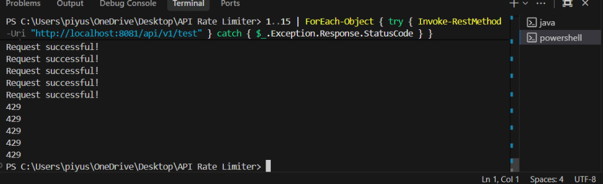

# API Rate Limiter (Token Bucket)

Hi! This is a backend project where I implemented an **API Rate Limiter** from scratch using **Java Spring Boot**. It efficiently handles traffic limits to prevent server overload.

I built this to understand how high-throughput systems handle concurrency and thread safety.

## 🚀 How It Works
It uses the **Token Bucket Algorithm**:
1.  Users have a "bucket" of tokens.
2.  Each request consumes 1 token.
3.  Tokens "refill" automatically over time.
4.  If the bucket is empty, the request is rejected (HTTP 429).

This ensures the server can handle bursts of traffic but still enforce an average rate limit.

## 🛠️ Tech Stack
*   **Java 17**
*   **Spring Boot 3**
*   **Maven**
*   **Concurrency**: usage of `synchronized` and `Atomic` variables for thread safety.

## 📸 Demo
Here is the rate limiter in action. You can see the first 10 requests succeeding, and then the 11th request getting blocked (429 Too Many Requests).



## 🏃‍♂️ How to Run

1.  **Clone the repo**
    ```bash
    git clone https://github.com/yourusername/api-rate-limiter.git
    ```
2.  **Run with Maven**
    ```bash
    mvn spring-boot:run
    ```
3.  **Test it**
    The app runs on port `8081`. You can hit the test endpoint:
    ```bash
    curl -v "http://localhost:8081/api/v1/test"
    ```

## ⚙️ Configuration
You can change the limits in `src/main/resources/application.properties`:
```properties
ratelimiter.capacity=10      # Max tokens in bucket
ratelimiter.refill-rate=1.0  # Tokens added per second
```

## 🧠 What I Learned
*   **Thread Safety**: Keeping the shared `TokenBucket` state consistent when multiple threads access it.
*   **Interceptor Pattern**: Using Spring `HandlerInterceptor` to catch requests before they reach the controller.
*   **Lazy Refill**: Instead of a background timer (which is resource-heavy), I calculate the token refill only when a request arrives.

---
*Feel free to connect or contribute!*
